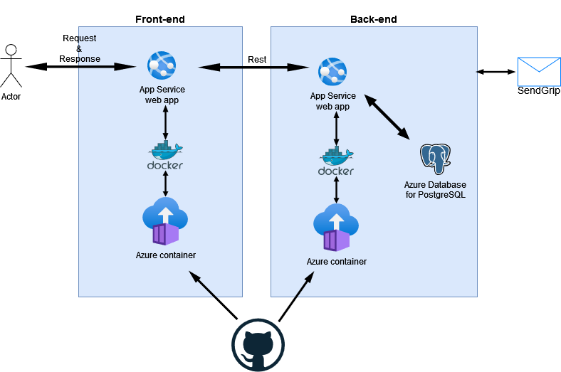

# mailSenderPW

Projekt ten składa się z dwóch aplikacji. Pierwsza z nich odpowiada za frontend, a druga za backend aplikacji i łączą się w całość.
### BACKEND 
###### Komponenty: 
Aplikacja wdrożona została przy użyciu Azure App Service. Komunikuje się ona z bazą danych Azure Database for PostgreSQL server. Aplikacja uruchomiona jest z wykorzystaniem Container Registry, który aktualizuje ją automatycznie przy każdym odświeżeniu kontenera. Dzięki Github Actions tworzony jest Docker image, który wysyła do Container Registry po wprowadzeniu zmian na branch’u main na repozytorium znajdującym się na GitHubie. 
###### Implementacja: 
Aplikacja została stworzona przy użyciu framework’u Rails opierającym się na języku programowania Ruby. Wykorzystane w nim biblioteki to: 
  - pg: obsługująca połączenie z bazą danych Postgres, 
  - rswag: w celu generowania dokumentacji OpenAPI Swagger, 
  - bcrypt: szyfrowanie haseł użytkowników,
  - jwt: szyfrowanie i odszyfrowywanie JSON Web Token,
  - simple_command: tworzenie wewnętrznych serwisów aplikacji. Do budowania kontenerów wykorzystany będzie Docker. W celu wysłania maili do użytkowników wykorzystywane będzie zewnętrzne API SendGrid.

### FRONTEND
###### Komponenty: 
Aplikacja powstała na Azure App Service, uruchamiana z Container Registry i updatowana automatycznie po każdym update konteneru. Dzięki GitHub actions robiony jest docker image i wysyłany do Container Registry przy każdej aktualizacji na main branch na githubie (push, merge, ...).
###### Implementacja:
  - vue3 + vue router jako główny framework. 
  - quasar jako biblioteka stylistyczna.
  - Typescript, Eslint, prettier do eleganckiego pisania kodu. Jest do testowania. 
  - Sass jako loader do scss, jako preprocesor CSS, do współpracy z quasarem i z możliwością użycia do uproszczenia stylowania. 
  - dockerfile do tworzenia obrazu.
  - axios do uproszczenia komunikacji z backendem.

### Diagram przypadków użycia

### Architektura aplikacji
{:height="200px" width="200px"}
